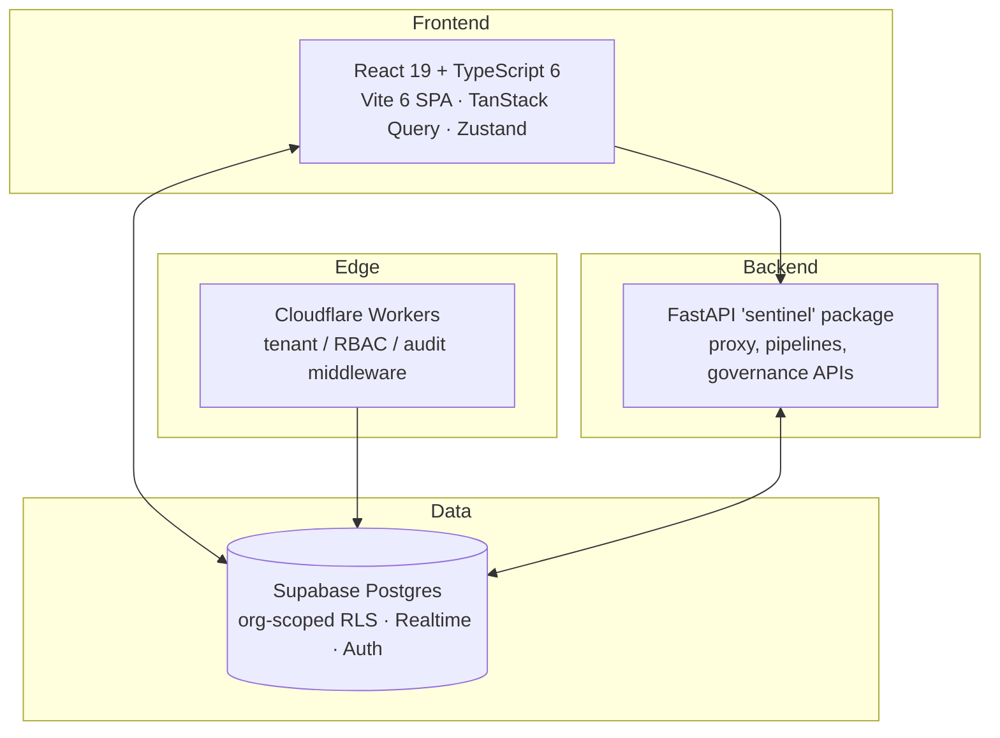
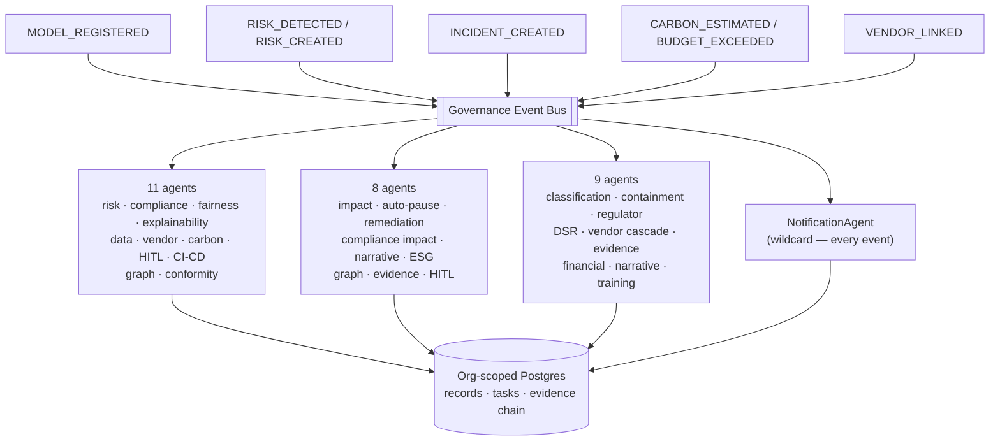

<div align="center">


# Sentinel AI GRC

**One AI Risk Platform — governance, risk & compliance for production AI**

[](./LICENSE)
[](https://github.com/CERTIFYI-AI/sentinel/actions)
[](./CONTRIBUTING.md)
[](https://www.typescriptlang.org/)
[](https://supabase.com)
[](https://workers.cloudflare.com/)

[**Live Demo**](https://sentinel.certifyi.ai) · [**Documentation**](./docs/) · [**Report a Bug**](https://github.com/CERTIFYI-AI/sentinel/issues/new?template=bug_report.md) · [**Request a Feature**](https://github.com/CERTIFYI-AI/sentinel/issues/new?template=feature_request.md)

</div>

---

## What Is Sentinel?

Sentinel AI GRC is an **open-source AI governance, risk, and compliance platform** for organisations deploying AI in regulated environments — financial services, healthcare, critical infrastructure.

Its design principle is that Sentinel is **one platform, not a collection of screens**: every module is a view onto the same governed entities. A model registered in the Model Registry is the *same* model that carries a risk classification, an impact assessment, bias audits, validation runs, MRC decisions, agent bindings, prompts, and runtime telemetry — all keyed by one identifier and linked in both directions (see [`CLAUDE.md`](./CLAUDE.md) for the engineering contract).

> **Open-Core Model:** The core governance engine is Apache-2.0 (see [`LICENSE`](./LICENSE)). Advanced enterprise modules (SSO/SAML, custom agent policies, managed SaaS) are available commercially.

---

## Platform Surface

The dashboard organises ~190 pages into interlinked module groups:

| Group | Modules |
| :--- | :--- |
| **AI Governance** | Model Registry · Model Lifecycle · Model DNA & Lineage · Prompt Registry |
| **Impact & Risk (AIIA)** | Impact Assessments (FRIA/DPIA/AIIA) · Use Case Registry · EU AI Act Risk Classification · Model Risk Committee (MRC) |
| **Validation & Evals** | Validation Lab · Explainability Center · Bias Audits · Metric Studio · Dataset Wizard & Explorer · Scenario Editor · Session Trace Viewer |
| **Agent Control** | Shadow AI Discovery · Agent Registry · Agent Permissions (IAM) · Choreography Canvas · Emergency Kill Switch |
| **Runtime Trust** | Trust engine, guardrail activity, live traces, cost/token dashboards, performance monitoring |
| **Security** | Threat scans · Red teaming & findings · Policy firewall · Keys vault |
| **Compliance** | Frameworks catalog (EU AI Act, NIST AI RMF, ISO/IEC 42001, SOC 2, GDPR) · Evidence & audits · Compliance calendar · Policies & documents |
| **Risk & Response** | Risk register · Incident response & playbooks · Tabletop exercises · Remediation & exceptions |
| **Vendors & Privacy** | TPRM (vendor registry, assessments, SLA) · DSR/rights management · Transfer impact (TIA) |
| **Data & Sustainability** | Dataset registry & governance · AIBOM supply chain · ESG & energy efficiency |
| **Enterprise** | CISO dashboard & board reports · Access control / IAM & identity governance · Business continuity & BIA · Training & committees |

Cross-module conventions: models are keyed by `ai_models.id` everywhere; deep links carry context (`?model=<id>` filters a list, `?open=<id>` opens a record); every governance record has a stable, shareable URL.

---

## Architecture



**Technology stack**
- **Frontend:** React 19, TypeScript 6, Vite 6, Tailwind CSS, TanStack Query, Zustand, Recharts, Phosphor Icons, sonner
- **Backend:** FastAPI (Python 3.11+), Pydantic, async — plus the `sentinel` CLI
- **Edge:** Cloudflare Workers (tenant, RBAC and audit middleware; rate limiting)
- **Database:** Supabase Postgres with org-scoped Row-Level Security; Realtime channels for live dashboards
- **Auth:** Supabase Auth; role resolution from `user_profiles` server-side; RBAC permission catalog in `packages/rbac`

---

## Agentic Mesh Architecture

Sentinel's governance is not a set of scheduled batch jobs. It is an **event-driven
mesh of 26 autonomous agents** that subscribe to governance events on a shared bus
and cascade: one act of governance triggers the next, so registering a model or
declaring an incident fans out into assessment, evidence capture, notification and
remediation without a human sequencing the steps.

The bus lives in `dashboard/src/lib/governance/eventBus.ts`; every agent is a module
under `dashboard/src/agents/` registered in `agents/index.ts`. Agents are **always-on**
in the sense that they are registered at app startup and react to every matching
event for the lifetime of the session — none of them polls, and none has to be
invoked from a screen.

### What actually fires the cascade

An agent mesh is only autonomous if something emits. Events are raised from the
service layer at the moment the governed fact changes — not from a screen, so
the cascade runs however the record was created:

| Emission point | Event | Cascade |
| --- | --- | --- |
| `modelService.upsertModel` (create) | `MODEL_REGISTERED` | 11 agents — opens the initial risk, maps controls, queues the fairness scan and conformity assessment, raises HITL where the tier demands it |
| `RiskAssessmentAgent` | `RISK_CREATED` | impact analysis, remediation plan, knowledge-graph edge |
| `HITLAgent` | `HITL_REVIEW_REQUIRED` | notification fan-out |

Emission is deliberately **fire-and-forget**: a failing agent must never roll
back or fail the user's save. Cascade outcomes are observable in Agent Control
and the `governance_events` / `agent_executions` tables, not in the return value
of the write that triggered them.

**Auto-created records are labelled as such.** Anything an agent writes carries
`source = 'auto-agent'`, `auto_generated = true`, a `related_entity_type/_id`
pointing back at what triggered it, and `source_event_id` naming the event —
so a reviewer can always tell machine-created governance from human-created,
and replay the chain. This is what makes Art. 14 oversight meaningful: you
cannot override a decision you cannot identify.



### Cascade 1 — `MODEL_REGISTERED`

Registering a model is the single act that produces a governance baseline. Eleven
agents fire, each writing a real record rather than a status flag.

| Agent | What it does on the event |
| --- | --- |
| `RiskAssessmentAgent` | Scores inherent risk and drafts the initial risk record |
| `ComplianceMapAgent` | Maps the model to the control set of every applicable framework |
| `FairnessScanAgent` | Opens the fairness baseline and queues the first bias scan |
| `ExplainabilityAgent` | Picks an interpretability method and creates the explainability report |
| `DataGovernanceAgent` | Cross-references training datasets for PII/PHI, consent and cross-border transfer |
| `VendorRiskAgent` | Links the model to its vendor and updates concentration risk |
| `CarbonAgent` | Estimates training and inference CO₂ footprint |
| `HITLAgent` | Creates the human-in-the-loop review tasks the tier demands |
| `CICDGateAgent` | Registers the EU AI Act conformity gate in the deployment workflow |
| `KnowledgeGraphAgent` | Adds nodes and edges so the model is reachable in the governance graph |
| `ConformityAssessmentAgent` | Opens the EU AI Act Article 43 conformity assessment record |

### Cascade 2 — `RISK_DETECTED` / `RISK_CREATED`

A detected risk propagates to everything that risk touches — including pausing the
model itself when severity warrants it.

| Agent | What it does on the event |
| --- | --- |
| `ImpactAnalysisAgent` | Traverses the knowledge graph for blast radius and annualised loss expectancy |
| `AutoPauseAgent` | Pauses the model outright for Critical/High severity |
| `RemediationPlannerAgent` | Generates the remediation plan and SLA-bearing tasks |
| `ComplianceImpactAgent` | Recalculates framework scores and the trust engine posture |
| `NarrativeEngineAgent` | Regenerates board and executive talking points, and regulator-facing language |
| `ESGAgent` | Recalculates ESG dimension scores from fairness, privacy and carbon signals |
| `EvidenceCollectionAgent` | Captures evidence into the tamper-evident hash chain |
| `KnowledgeGraphAgent` | Records the risk and its edges in the graph |
| `HITLAgent` | Raises the human review the severity requires |

### Cascade 3 — `INCIDENT_CREATED`

An incident is the highest-urgency path: containment first, then regulatory clocks,
then the long tail of impact and learning.

| Agent | What it does on the event |
| --- | --- |
| `IncidentClassificationAgent` | Assigns P0–P4 severity and names an incident commander |
| `ContainmentAgent` | For P0/P1: pauses models, triggers BCP failover, blocks CI/CD, preserves evidence |
| `RegulatorNotifyAgent` | Prepares SEC / FCA / ICO (GDPR 72-hour) / EU AI Act notification templates |
| `DSRImpactAgent` | Identifies affected data subjects and opens data-subject-request entries |
| `VendorCascadeAgent` | Handles vendor SLA breach and BCP-004 failover |
| `EvidenceCollectionAgent` | Captures incident evidence into the hash chain |
| `FinancialImpactAgent` | Calculates regulatory fine exposure and updates ALE |
| `NarrativeEngineAgent` | Produces the incident narrative for board and regulator audiences |
| `TrainingUpdateAgent` | Turns lessons learned into refresher training assignments |

### Always-on and secondary triggers

- **`NotificationAgent`** is registered against the `*` wildcard — it observes **every**
  event on the bus and fans out notifications and tasks. It is the one agent guaranteed
  to run on any governance activity.
- **`ESGAgent`** also fires on `CARBON_ESTIMATED`, and **`HITLAgent`** on
  `CARBON_BUDGET_EXCEEDED`, so sustainability breaches escalate to a human like any
  other risk.
- **`KnowledgeGraphAgent`** also fires on `VENDOR_LINKED`, keeping third-party edges
  current in the graph.

Several agents deliberately appear in more than one cascade — `EvidenceCollectionAgent`,
`KnowledgeGraphAgent`, `HITLAgent` and `NarrativeEngineAgent` are cross-cutting, which
is why 26 distinct agents produce more than 26 registrations.

### Adding an agent

1. Write the handler in `dashboard/src/agents/<name>Agent.ts`, exporting a function
   that takes the event payload and performs **real** writes (service-layer calls that
   throw on failure — never a local state mutation).
2. Register it in `dashboard/src/agents/index.ts` against the events it should observe.
3. Executions are observable through `subscribeToAgentExecutions`, and surface in the
   Agent Control module.

---

## Quick Start

### Prerequisites
- **Node.js** 20+ · **Python** 3.11+ · a **Supabase** project (free tier works)

### 1 — Clone & install
```bash
git clone https://github.com/CERTIFYI-AI/sentinel.git
cd sentinel
cd dashboard && npm install      # frontend
cd .. && make install            # python backend (pip install -e .)
```

### 2 — Configure
```bash
cp .env.example .env
# set VITE_SUPABASE_URL, VITE_SUPABASE_ANON_KEY (and SUPABASE_SERVICE_ROLE_KEY for server-side jobs)
```

### 3 — Database
```bash
supabase db reset                # applies supabase/migrations (schema + idempotent demo seeds)
```
The demo seed provisions one organisation with a fully-interlinked graph: registered models, use cases, impact assessments, risk classifications, MRC meetings & votes, validation runs, datasets, scenarios, traces, agents, credentials, workflows and kill-switch events.

### 4 — Run
```bash
cd dashboard && npm run dev      # frontend on :5000
make serve                       # FastAPI backend (optional for dashboard-only work)
```

Demo sign-in credentials are created by the seed — see [`docs/`](./docs/) (getting started) rather than this README; production builds never display credentials.

---

## Project Structure

```text
sentinel/
├── dashboard/            # React 19 + TS 6 + Vite SPA
│   └── src/
│       ├── pages/        # module pages, grouped by domain
│       ├── components/   # shared UI library (PageHeader, DataTable, states, …)
│       ├── services/     # Supabase data layer — writes throw, org via RLS
│       ├── hooks/        # TanStack Query wrappers (invalidate on mutation)
│       └── lib/          # supabase client, auth, logger, audit, RBAC
├── sentinel/             # Python backend (FastAPI + `sentinel` CLI): proxy, pipelines, APIs
├── workers/              # Cloudflare Workers: tenant/RBAC/audit middleware, rate limiter
├── supabase/migrations/  # schema + RLS + idempotent seeds (source of truth)
├── packages/             # shared internal packages (RBAC permission catalog, schemas)
├── frameworks/           # compliance framework control definitions
├── openapi/              # API specification
├── k8s/ · docker/        # deploy manifests & container build
├── docs/                 # getting-started, architecture, modules, api, operations, security
└── tests/                # pytest suite (+ dashboard unit tests & Playwright e2e)
```

---

## Engineering Contract

All contributions follow the platform rules in [`CLAUDE.md`](./CLAUDE.md):

1. **Interlink everything** — a module that can't reach and be reached from the rest of the platform is unfinished.
2. **One id-space** — shared entities are referenced by their canonical id, resolved to names at render time.
3. **Real, org-scoped backend** — tenant-scoped tables with RLS; scoping columns filled by DB defaults, never by the client.
4. **Never fake success** — writes throw; success toasts fire only after the write resolves.
5. **No invented data** — honest empty states instead of fabricated metrics.

Quality gates: `npm run typecheck`, `npm run test`, `npm run lint` (dashboard) and `pytest` (backend) run in CI, alongside secret scanning, SAST, dependency audit and DCO sign-off checks.

---

## Supported Compliance Frameworks

| Framework | Coverage |
|---|---|
| **EU AI Act** | Annex III / Article 5 risk classification engine, FRIA workflows, Art. 50 transparency obligations |
| **NIST AI RMF 1.0** | Govern / Map / Measure / Manage mappings across risk & validation modules |
| **ISO/IEC 42001** | AI management system controls (in progress) |
| **SOC 2 / GDPR** | Control mappings, DSR & consent tracking, transfer impact assessments |

---

## Contributing

We welcome contributions — see [`CONTRIBUTING.md`](./CONTRIBUTING.md). Commits require DCO sign-off (`git commit -s`).

**Current priorities:** ISO/IEC 42001 coverage · server-enforced RBAC rollout · SSO/SAML flow completion · E2E coverage across high-risk modules.

---

## Security

Found a vulnerability? Please do **not** open a public issue — see [`SECURITY.md`](./SECURITY.md) for responsible disclosure.

---

## License

Copyright 2026 CERTIFYI-AI / Dignep Group Pvt. Ltd. — Apache-2.0 (see [`LICENSE`](./LICENSE)). Enterprise modules (SSO/SAML, custom agent policies, managed SaaS) are proprietary.

---

<div align="center">

Built by [Dignep Group Pvt. Ltd.](https://dignep.com.np/) · Powering AI Governance for Regulated Industries

[certifyi.ai](https://certifyi.ai/) · [LinkedIn](https://linkedin.com/company/certifyi) · [Twitter/X](https://x.com/getcertifyi)

</div>
