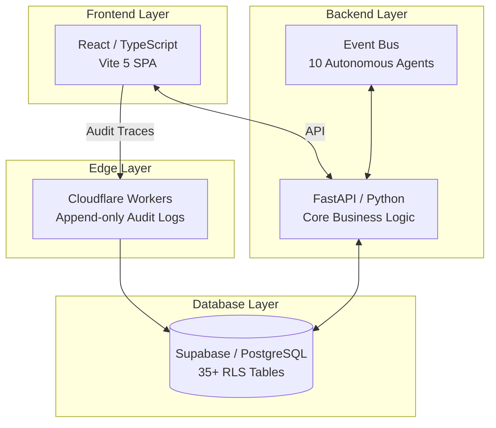

<div align="center">


# Sentinel AI GRC

**The Trust Layer for Production AI**

[](./LICENSE)
[](https://github.com/CERTIFYI-AI/sentinel/actions)
[](./CONTRIBUTING.md)
[](https://www.typescriptlang.org/)
[](https://supabase.com)
[](https://workers.cloudflare.com/)

[**Live Demo**](https://sentinel.certifyi.ai) · [**Documentation**](./docs/) · [**Report a Bug**](https://github.com/CERTIFYI-AI/sentinel/issues/new?template=bug_report.md) · [**Request a Feature**](https://github.com/CERTIFYI-AI/sentinel/issues/new?template=feature_request.md)

</div>

---

## What Is Sentinel?

Sentinel AI GRC is an **open-source AI governance, risk, and compliance platform** purpose-built for organisations deploying AI models in highly regulated environments such as financial services, healthcare, and critical infrastructure.

Unlike traditional GRC tools that awkwardly bolt AI onto legacy risk frameworks, Sentinel is **AI-native from the ground up**. Every model, agent, and decision chain is treated as a first-class governance object, complete with mandatory audit trails, continuous policy enforcement, and observable autonomous oversight.

> **Open-Core Model:** The core governance engine is open-source under the Apache-2.0 license (see [`LICENSE`](./LICENSE)). Advanced enterprise modules (SSO/SAML, custom agent policies, managed SaaS) are available commercially.

---

## Why Sentinel Exists

| The Problem | The Sentinel Solution |
| :--- | :--- |
| **Opaque Decisions:** AI models make decisions with zero audit trail. | **Immutable Logs:** Append-only decision logs generated on every inference. |
| **Black Box Risk:** Compliance teams can't understand model behaviour. | **Clear Rules:** A human-readable policy engine featuring explainability hooks. |
| **Outdated Frameworks:** Legacy risk systems weren't built for autonomous agents. | **Observable State:** 10 autonomous governance agents providing observable oversight. |
| **Reactive Governance:** GRC tools act after the fact, not continuously. | **Active Monitoring:** Real-time dashboards with threshold alerting across all models. |
| **No Standardisation:** Lack of a standard for AI model risk classification. | **Native Frameworks:** Built-in EU AI Act, NIST AI RMF, and ISO/IEC 42001 controls. |

---

## Architecture

Sentinel is built on a modern, highly scalable stack designed for reliability and speed.



**Technology Stack:**
- **Frontend:** React 18, TypeScript 5.x, Vite, Tailwind CSS, Recharts
- **Backend:** FastAPI (Python), Pydantic, async/await
- **Edge:** Cloudflare Workers (High-throughput, append-only audit log mutations)
- **Database:** Supabase (PostgreSQL) with strict Row Level Security (RLS) on all tables
- **Auth:** Supabase Auth, robust RBAC supporting 6 core roles
- **Design:** Outfit font, `#368F4D` brand green, tailored enterprise UI (light mode only)

---

## Key Features

### AI Model Registry
Register, version, and classify every AI model across your organisation. Automatically assign risk tiers, assign ownership, and map to compliance frameworks.

### Policy Engine
Define robust governance policies in plain language. The engine translates these into enforceable computational rules attached to models, agents, and data pipelines.

### Continuous Monitoring
Access real-time dashboards tracking model drift, inference anomalies, and policy violations. Set up threshold-based alerting with configurable escalation paths.

### Risk Assessment Workflows
Conduct structured risk assessments fully aligned with the **EU AI Act**, **NIST AI RMF 1.0**, and **ISO/IEC 42001**. Track and compute risk scores over time.

### Audit & Compliance
Generate immutable, append-only audit trails for every governance decision. Easily produce export-ready compliance reports for regulators and stakeholders.

### Agent Observability
Gain real-time visibility into the actions of 10 autonomous governance agents—know exactly what they triggered, on which model, at what time, and with what outcome.

### Security Questionnaire Automation
Accelerate vendor security assessments (SOC 2, ISO 27001, CAIQ) using AI-assisted automation powered by your existing policy and control libraries.

---

## Quick Start

### Prerequisites
- **Node.js** 20+
- **Python** 3.11+
- **Supabase** account (Free tier supported)
- **Cloudflare Workers** account (Free tier supported)

### 1. Clone the Repository
```bash
git clone https://github.com/CERTIFYI-AI/sentinel.git
cd sentinel
```

### 2. Install Dependencies
```bash
# Frontend (React dashboard)
cd dashboard && npm install

# Backend (Python `sentinel` package + CLI)
cd .. && make install        # == pip install -e .   (use `make dev` for dev extras)
```

### 3. Configure the Environment
```bash
cp .env.example .env
```
Update `.env` with your credentials:
```env
# Supabase
VITE_SUPABASE_URL=https://your-project-ref.supabase.co
VITE_SUPABASE_ANON_KEY=your-anon-key
SUPABASE_SERVICE_ROLE_KEY=your-service-role-key

# Cloudflare
CF_ACCOUNT_ID=your-cf-account-id
CF_WORKERS_TOKEN=your-cf-token

# App
VITE_APP_ENV=development
```

### 4. Seed the Database
```bash
# Applies all migrations and seeds the canonical demo tenant
supabase db reset
```
*This creates **Sentinel Financial Corp** — a canonical demo organisation featuring 6 users, 6 AI models, 12 agents, and 30 days of synthetic governance events, ready to demo in under 2 minutes.*

### 5. Run the Platform
```bash
# Terminal 1 — Frontend (Vite dev server on :5000)
cd dashboard && npm run dev

# Terminal 2 — Backend (FastAPI via the sentinel CLI)
make serve                   # == sentinel serve --reload

# Terminal 3 — Edge Workers (local dev)
cd workers && wrangler dev
```
Navigate to [http://localhost:5000](http://localhost:5000) in your browser.

**Demo Credentials:**
| Role | Email | Password |
|---|---|---|
| **Chief Risk Officer** | cro@sentinelfinancial.com | `demo-sentinel-2026` |
| **Compliance Officer** | compliance@sentinelfinancial.com | `demo-sentinel-2026` |
| **AI Engineer** | engineer@sentinelfinancial.com | `demo-sentinel-2026` |
| **Auditor (Read-Only)** | auditor@sentinelfinancial.com | `demo-sentinel-2026` |
| **Data Scientist** | datascience@sentinelfinancial.com | `demo-sentinel-2026` |
| **Admin** | admin@sentinelfinancial.com | `demo-sentinel-2026` |

---

## Project Structure

```text
sentinel/
├── dashboard/                   # React 18 + TypeScript + Vite SPA (the frontend)
│   └── src/
│       ├── pages/               # 300+ GRC module pages (incl. subdirectories)
│       ├── components/          # Shared enterprise UI library (Button, DataTable, …)
│       ├── hooks/               # TanStack Query data hooks
│       ├── styles/tokens.css    # Design tokens — single source of truth for colour
│       └── lib/                 # Core utilities (Supabase client, EventBus, logger)
├── sentinel/                    # Canonical Python backend (FastAPI + `sentinel` CLI)
├── workers/                     # Cloudflare Workers — immutable audit-log ingestion
├── supabase/                    # Supabase project config
├── migrations/                  # Database schema migrations
├── openapi/                     # Published OpenAPI specification
├── frameworks/                  # Compliance framework control definitions
├── packages/                    # Shared internal packages
├── k8s/ · docker/               # Kubernetes manifests & container build context
├── docs/                        # Architecture, runbooks, module & API reference
├── tests/                       # Backend test suite (pytest)
└── scripts/                     # Tooling and automation
```

> The legacy `server/` directory is **deprecated** (superseded by `sentinel/`) and slated for removal — do not build on it.

---

## Supported Compliance Frameworks

| Framework | Status | Coverage |
|---|---|---|
| **EU AI Act (2024)** | ✅ Implemented | Risk classification, prohibited use checks, transparency requirements. |
| **NIST AI RMF 1.0** | ✅ Implemented | Govern, Map, Measure, Manage functions. |
| **SOC 2 Type II** | ✅ Implemented | CC6-CC9 controls mapped to AI systems. |
| **GDPR / Data Privacy** | ✅ Implemented | Data lineage, consent tracking for training data. |
| **ISO/IEC 42001:2023** | 🚧 In Progress | AI management system controls. |

---

## Autonomous Governance Agents

Sentinel operates 10 always-on governance agents running on a shared event bus:

| Agent | Responsibility |
|---|---|
| `PolicyEnforcementAgent` | Validates model behaviour against active policies in real time. |
| `DriftDetectionAgent` | Monitors model output distribution for statistical and conceptual drift. |
| `BiasMonitorAgent` | Runs continuous fairness testing across protected attributes. |
| `DataLineageAgent` | Tracks training data provenance and verifies consent validity. |
| `IncidentTriageAgent` | Auto-classifies and correctly routes governance incidents. |
| `ComplianceCheckAgent` | Maps active controls to compliance frameworks and flags gaps. |
| `AccessAuditAgent` | Reviews RBAC assignments and detects potential privilege escalation. |
| `ExplainabilityAgent` | Generates accessible, human-readable model decision summaries. |
| `ChangeDetectionAgent` | Detects model version changes and automatically triggers assessments. |
| `ReportingAgent` | Compiles scheduled compliance reports for key stakeholders. |

*Agent events are observable in real-time via the `/agents` panel in the dashboard.*

---

## Role-Based Access Control (RBAC)

| Role | Capabilities |
|---|---|
| `super_admin` | Full platform access and multi-tenant management. |
| `admin` | User management and full access to all GRC functions. |
| `compliance_officer` | Policy creation, compliance auditing, and reporting. |
| `risk_manager` | Risk assessments and control mapping. |
| `ai_engineer` | Model registration and technical configuration. |
| `auditor` | Safe, read-only access to all GRC records. |

---

## Contributing

We welcome contributions! Please review our [`CONTRIBUTING.md`](./CONTRIBUTING.md) before submitting a PR.

**Current Priorities:**
- [ ] Complete ISO/IEC 42001 control mapping
- [ ] Multi-tenant enterprise module development
- [ ] Agent plugin API for custom governance agents
- [ ] Expand E2E (Playwright) coverage across high-risk modules

*Looking for a place to start? Check out our [`good first issue`](https://github.com/CERTIFYI-AI/sentinel/labels/good%20first%20issue) label.*

---

## Roadmap

### v1.0 — General Availability ✅ Shipped
- [x] Core GRC module pages (300+)
- [x] 10 autonomous governance agents
- [x] Append-only audit log (Cloudflare Workers)
- [x] RBAC with 6 roles
- [x] Full Supabase live-data wiring (no mock data)
- [x] Agent observability panel
- [x] Canonical seed data (Sentinel Financial Corp)

### v1.1 — Community Release ✅ Shipped
- [x] Design-token system (single source of truth for colour)
- [x] Enterprise error boundary with diagnostics
- [x] Command palette (⌘K) + keyboard navigation
- [x] OpenAPI spec published (`openapi/`)
- [ ] ISO/IEC 42001 full coverage
- [ ] Public agent plugin API
- [ ] Docker Compose single-command setup

### v2.0 — Enterprise
- [ ] Multi-tenant architecture
- [ ] Custom agent policy builder (Commercial)
- [ ] Managed SaaS offering (Commercial)
- [ ] SSO / SAML integration (Commercial)

---

## Security

Found a vulnerability? Please do **not** open a public issue. See our [`SECURITY.md`](./SECURITY.md) for the responsible disclosure policy.

---

## License

```text
Copyright 2026 CERTIFYI-AI / Dignep Group Pvt. Ltd.

Licensed under the Apache License, Version 2.0.
You may not use this file except in compliance with the License.
See LICENSE for the full text.
```

The **core platform** is licensed under Apache-2.0 (see [`LICENSE`](./LICENSE)). Enterprise modules (SSO/SAML, custom agent policies, managed SaaS) are proprietary.

---

<div align="center">

Built by [Dignep Group Pvt.Ltd.](https://dignep.com.np/) · Powering AI Governance for Regulated Industries

[certifyi.ai](https://certifyi.ai/) · [LinkedIn](https://linkedin.com/company/certifyi) · [Twitter/X](https://x.com/getcertifyi) · [Facebook](https://www.facebook.com/certifyi) · [Instagram](https://www.instagram.com/certifyi) · [YouTube](https://www.youtube.com/@certifyi)

</div>
