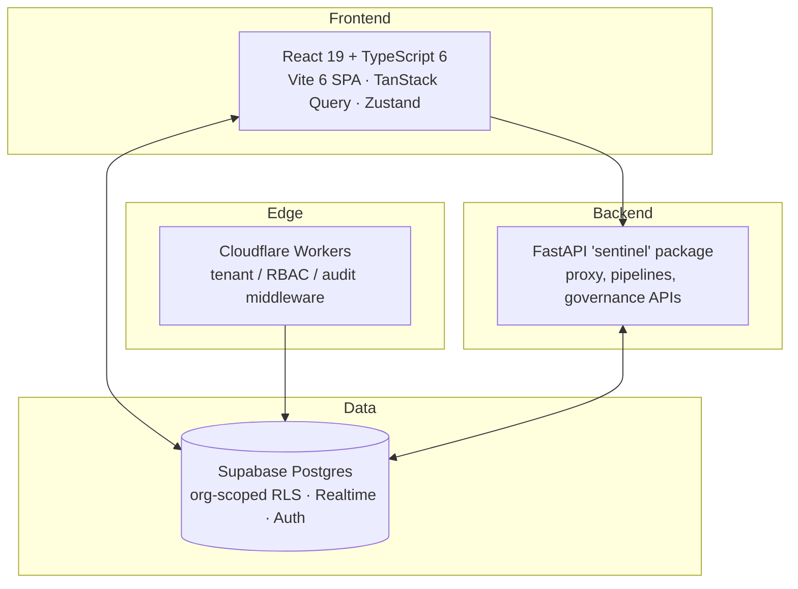

<div align="center">


# Sentinel AI GRC

**One AI Risk Platform — governance, risk & compliance for production AI**

[](./LICENSE)
[](https://github.com/CERTIFYI-AI/sentinel/actions)
[](./CONTRIBUTING.md)
[](https://www.typescriptlang.org/)
[](https://supabase.com)
[](https://workers.cloudflare.com/)

[**Live Demo**](https://sentinel.certifyi.ai) · [**Documentation**](./docs/) · [**Report a Bug**](https://github.com/CERTIFYI-AI/sentinel/issues/new?template=bug_report.md) · [**Request a Feature**](https://github.com/CERTIFYI-AI/sentinel/issues/new?template=feature_request.md)

</div>

---

## What Is Sentinel?

Sentinel AI GRC is an **open-source AI governance, risk, and compliance platform** for organisations deploying AI in regulated environments — financial services, healthcare, critical infrastructure.

Its design principle is that Sentinel is **one platform, not a collection of screens**: every module is a view onto the same governed entities. A model registered in the Model Registry is the *same* model that carries a risk classification, an impact assessment, bias audits, validation runs, MRC decisions, agent bindings, prompts, and runtime telemetry — all keyed by one identifier and linked in both directions (see [`CLAUDE.md`](./CLAUDE.md) for the engineering contract).

> **Open-Core Model:** Everything in this repository is Apache-2.0 (see [`LICENSE`](./LICENSE) and [`NOTICE`](./NOTICE)) — there is no dual-licensed code here. Advanced enterprise offerings (managed SaaS, premium support, hosted SSO management) are commercial services built *around* this codebase, not gated modules inside it.

---

## Platform Surface

The dashboard organises ~190 pages into interlinked module groups:

| Group | Modules |
| :--- | :--- |
| **AI Governance** | Model Registry · Model Lifecycle · Model DNA & Lineage · Prompt Registry |
| **Impact & Risk (AIIA)** | Impact Assessments (FRIA/DPIA/AIIA) · Use Case Registry · EU AI Act Risk Classification · Model Risk Committee (MRC) |
| **Validation & Evals** | Validation Lab · Explainability Center · Bias Audits · Metric Studio · Dataset Wizard & Explorer · Scenario Editor · Session Trace Viewer |
| **Agent Control** | Shadow AI Discovery · Agent Registry · Agent Permissions (IAM) · Choreography Canvas · Emergency Kill Switch |
| **Runtime Trust** | Trust engine, guardrail activity, live traces, cost/token dashboards, performance monitoring |
| **Security** | Threat scans · Red teaming & findings · Policy firewall · Keys vault |
| **Compliance** | Frameworks catalog (EU AI Act, NIST AI RMF, ISO/IEC 42001, SOC 2, GDPR) · Evidence & audits · Compliance calendar · Policies & documents |
| **Risk & Response** | Risk register · Incident response & playbooks · Tabletop exercises · Remediation & exceptions |
| **Vendors & Privacy** | TPRM (vendor registry, assessments, SLA) · DSR/rights management · Transfer impact (TIA) |
| **Data & Sustainability** | Dataset registry & governance · AIBOM supply chain · ESG & energy efficiency |
| **Enterprise** | CISO dashboard & board reports · Access control / IAM & identity governance · Business continuity & BIA · Training & committees |

Cross-module conventions: models are keyed by `ai_models.id` everywhere; deep links carry context (`?model=<id>` filters a list, `?open=<id>` opens a record); every governance record has a stable, shareable URL.

---

## Architecture



**Technology stack**
- **Frontend:** React 19, TypeScript 6, Vite 6, Tailwind CSS, TanStack Query, Zustand, Recharts, Phosphor Icons, sonner
- **Backend:** FastAPI (Python 3.11+), Pydantic, async — plus the `sentinel` CLI
- **Edge:** Cloudflare Workers (tenant, RBAC and audit middleware; rate limiting)
- **Database:** Supabase Postgres with org-scoped Row-Level Security; Realtime channels for live dashboards
- **Auth:** Supabase Auth; role resolution from `user_profiles` server-side; RBAC permission catalog in `packages/rbac`

---

## Quick Start

### Prerequisites
- **Node.js** 20+ · **Python** 3.11+ · a **Supabase** project (free tier works)

### 1 — Clone & install
```bash
git clone https://github.com/CERTIFYI-AI/sentinel.git
cd sentinel
cd dashboard && npm install      # frontend
cd .. && make install            # python backend (pip install -e .)
```

### 2 — Configure
```bash
cp .env.example .env
# set VITE_SUPABASE_URL, VITE_SUPABASE_ANON_KEY (and SUPABASE_SERVICE_ROLE_KEY for server-side jobs)
```

### 3 — Database
```bash
supabase db reset                # applies supabase/migrations (schema + idempotent demo seeds)
```
The demo seed provisions one organisation with a fully-interlinked graph: registered models, use cases, impact assessments, risk classifications, MRC meetings & votes, validation runs, datasets, scenarios, traces, agents, credentials, workflows and kill-switch events.

### 4 — Run
```bash
cd dashboard && npm run dev      # frontend on :5000
make serve                       # FastAPI backend (optional for dashboard-only work)
```

### 5 — First sign-in

The seed provisions demo *data*, not demo *logins* — there are no shared
credentials anywhere in this repo. Create your own user and link it to the
demo organisation:

1. Supabase Studio → **Authentication → Users → Add user** (email + password).
2. Link the user to the demo org (SQL editor):
   ```sql
   insert into user_profiles (id, org_id, full_name, role)
   values ('<auth-user-uuid>', '00000000-0000-0000-0000-000000000001', 'Your Name', 'org_admin');
   ```
3. Sign in at `http://localhost:5000` with that email and password.

> **All demo data is fictional.** Seeded organisations, people, models,
> incidents and datasets are invented for the demo scenario. Real
> institutions (e.g. Nepal Rastra Bank) appear only as narrative context and
> do not represent real data or relationships.

---

## Project Structure

```text
sentinel/
├── dashboard/            # React 19 + TS 6 + Vite SPA
│   └── src/
│       ├── pages/        # module pages, grouped by domain
│       ├── components/   # shared UI library (PageHeader, DataTable, states, …)
│       ├── services/     # Supabase data layer — writes throw, org via RLS
│       ├── hooks/        # TanStack Query wrappers (invalidate on mutation)
│       └── lib/          # supabase client, auth, logger, audit, RBAC
├── sentinel/             # Python backend (FastAPI + `sentinel` CLI): proxy, pipelines, APIs
├── workers/              # Cloudflare Workers: tenant/RBAC/audit middleware, rate limiter
├── supabase/migrations/  # schema + RLS + idempotent seeds (source of truth)
├── packages/             # shared internal packages (RBAC permission catalog, schemas)
├── frameworks/           # compliance framework control definitions
├── openapi/              # API specification
├── k8s/ · docker/        # deploy manifests & container build
├── docs/                 # getting-started, architecture, modules, api, operations, security
└── tests/                # pytest suite (+ dashboard unit tests & Playwright e2e)
```

---

## Engineering Contract

All contributions follow the platform rules in [`CLAUDE.md`](./CLAUDE.md):

1. **Interlink everything** — a module that can't reach and be reached from the rest of the platform is unfinished.
2. **One id-space** — shared entities are referenced by their canonical id, resolved to names at render time.
3. **Real, org-scoped backend** — tenant-scoped tables with RLS; scoping columns filled by DB defaults, never by the client.
4. **Never fake success** — writes throw; success toasts fire only after the write resolves.
5. **No invented data** — honest empty states instead of fabricated metrics.

Quality gates: `npm run typecheck`, `npm run test`, `npm run lint` (dashboard) and `pytest` (backend) run in CI, alongside secret scanning, SAST, dependency audit and DCO sign-off checks.

---

## Supported Compliance Frameworks

| Framework | Coverage |
|---|---|
| **EU AI Act** | Annex III / Article 5 risk classification engine, FRIA workflows, Art. 50 transparency obligations |
| **NIST AI RMF 1.0** | Govern / Map / Measure / Manage mappings across risk & validation modules |
| **ISO/IEC 42001** | AI management system controls (in progress) |
| **SOC 2 / GDPR** | Control mappings, DSR & consent tracking, transfer impact assessments |

---

## Contributing

We welcome contributions — see [`CONTRIBUTING.md`](./CONTRIBUTING.md). Commits require DCO sign-off (`git commit -s`).

**Current priorities:** ISO/IEC 42001 coverage · server-enforced RBAC rollout · SSO/SAML flow completion · E2E coverage across high-risk modules.

---

## Security

Found a vulnerability? Please do **not** open a public issue — see [`SECURITY.md`](./SECURITY.md) for responsible disclosure.

---

## License

Copyright 2026 CERTIFYI-AI / Dignep Group Pvt. Ltd. — Apache-2.0 (see [`LICENSE`](./LICENSE)). Enterprise modules (SSO/SAML, custom agent policies, managed SaaS) are proprietary.

---

<div align="center">

Built by [Dignep Group Pvt. Ltd.](https://dignep.com.np/) · Powering AI Governance for Regulated Industries

[certifyi.ai](https://certifyi.ai/) · [LinkedIn](https://linkedin.com/company/certifyi) · [Twitter/X](https://x.com/getcertifyi)

</div>
