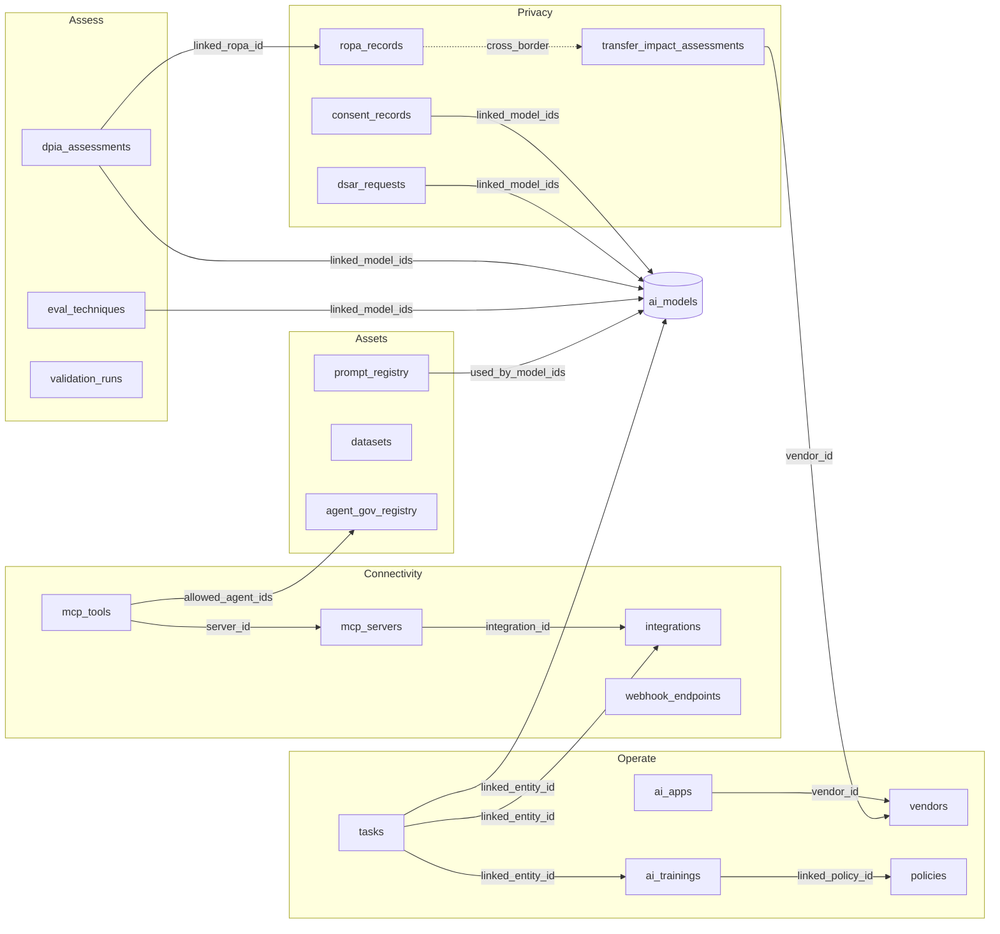

# Platform Interlink Map

> Sentinel is one AI risk platform, not a collection of screens. This map records
> how the governed entities actually connect — verified against the live schema,
> not asserted from intent.
>
> Last verified: 2026-08-16 · Method: `docs/contributing/review-process.md` Gate 1

## Why this document exists

Two failure modes hide in a platform this size, and both look fine on a screen:

1. **A link column that nobody populates.** The schema supports the
   relationship, the UI renders "—" for every row, and the connection is
   theoretical. Five such columns were found and populated on 2026-08-16.
2. **A module reachable only from the sidebar.** Nothing in the platform points
   at it, so a user arrives only by hunting the menu, and a record in it is a
   dead end.

Both are measured below rather than described.

## Verified entity graph

Every edge is checked with a resolve query — `total` must equal `resolves`.
All twelve pass at 100%.



## Resolve-query results

| Edge | Total | Resolves |
|---|---|---|
| `tasks → ai_models` | 4 | 4 |
| `tasks → integrations` | 2 | 2 |
| `tasks → ai_trainings` | 1 | 1 |
| `mcp_servers → integrations` | 4 | 4 |
| `mcp_tools → mcp_servers` | 9 | 9 |
| `mcp_tools → agent_gov_registry` | 10 | 10 |
| `eval_techniques → ai_models` | 7 | 7 |
| `dpia_assessments → ropa_records` | 4 | 4 |
| `dpia_assessments → ai_models` | 4 | 4 |
| `prompt_registry → ai_models` | 3 | 3 |
| `ai_apps → vendors` | 4 | 4 |
| `ai_trainings → policies` | 4 | 4 |

## Populated link columns

A column that resolves 100% but is populated on 0 rows is not an interlink —
it is an unused schema affordance. Coverage as at 2026-08-16:

| Column | Rows | Populated |
|---|---|---|
| `dsar_requests.ai_systems_affected` | 10 | 10 |
| `dsar_requests.linked_model_ids` | 10 | 10 |
| `consent_records.ai_systems` | 10 | 10 |
| `consent_records.linked_model_ids` | 10 | 10 |
| `transfer_impact_assessments.vendor_id` | 4 | 4 |
| `controls.framework_id` | 385 | 385 |
| `mcp_servers.integration_id` | 6 | 4 |
| `eval_techniques.linked_model_ids` | 8 | 6 |

The last two are intentionally partial: a knowledge-base MCP server fronts no
connector, and two evaluation techniques apply inventory-wide rather than to
named models. Both render as an explicit statement ("all models", "—"), never
as a silent blank.

## The governance chains

Interlinks matter because they form chains an auditor can walk end to end.

**Model accountability chain**
`ai_models` → risk tier → impact assessment → validation runs → bias audits →
runtime traces → remediation tasks. A model record surfaces its own live
figures (prompts, cost, fallbacks, tool calls) rather than linking blindly.

**Privacy chain**
`ropa_records` (Art. 30) → `dpia_assessments` (Art. 35, with the Art. 36
consultation trigger computed from residual risk) → `transfer_impact_assessments`
(Chapter V) → `vendors`. `dsar_requests` and `consent_records` both resolve to
the AI systems that actually hold or rely on the data, so an erasure request is
actionable and a withdrawal is traceable.

**Agent capability chain**
`integrations` → `mcp_servers` (approval state, data ceiling) → `mcp_tools`
(risk tier, human-review gate) → `agent_gov_registry` allow-list. An empty
allow-list permits no agent, and the interface says so rather than treating
empty as unrestricted.

**Workforce chain**
`policies` → `ai_trainings` (Art. 4 literacy) → completion evidence → `tasks`
for anyone incomplete.

## Module reachability

Measured across all sidebar routes, excluding chrome (sidebar, route table,
breadcrumbs, command palette, user guide) — a route only counts as reachable if
something in the *platform* points at it.

| Metric | Count |
|---|---|
| Sidebar routes | 131 |
| Reachable from the platform | 100 |
| Sidebar-only (isolated) | 31 |

Reachability is measured with this, matching all quoting forms (a route linked
via a template literal such as `` `/models/lifecycle?model=${id}` `` is
reachable and must not be counted as isolated):

```bash
python3 - <<'PY'
import re, subprocess
from pathlib import Path
side = Path('dashboard/src/components/Sidebar.tsx').read_text()
routes = sorted(set(re.findall(r"to:\s*'(/[a-z0-9\-/]+)'", side)))
chrome = ('Sidebar.tsx','App.tsx','breadcrumbs','CommandPalette','UserGuideDrawer')
body = [l for l in subprocess.run(['grep','-rn','--include=*.tsx','--include=*.ts','',
        'dashboard/src'], capture_output=True, text=True).stdout.splitlines()
        if not any(c in l for c in chrome)]
for r in routes:
    pat = re.compile(re.escape(r) + r"(?![a-z0-9\-])")
    if not any(pat.search(l) for l in body): print("ISOLATED", r)
PY
```

### Remaining isolated modules

The 31 still sidebar-only are, with few exceptions, the modules tracked as
**TD-001** in [`../reference/technical-debt.md`](../reference/technical-debt.md)
— they read generic demo tables, so they have no real entities to link to or
from. Interlinking them is part of migrating them, not a separate task.

Isolation is therefore a *leading indicator* of the demo-table debt rather than
an independent defect, which is why the two are tracked together.

## Adding an interlink

1. Store the **canonical uuid** (`ai_models.id`, `ropa_records.id`, …) — never a
   name, slug or business code. Resolve the display name at render time.
2. Render it as a **resolved link**, not a bare navigation: prefer
   "Fallback failovers · 3, 1 failed" over "Fallback failovers →".
3. Where an id cannot be resolved, show **"Unavailable"** — never a raw uuid.
4. Make it **bidirectional** where the relationship is meaningful in both
   directions, and say so in both module docs.
5. **Prove it** with the resolve query and record the output in the PR.
